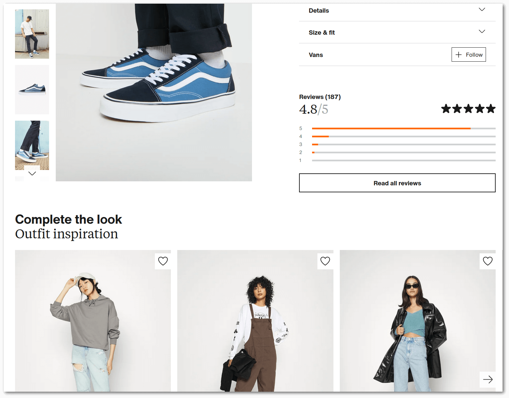

# Links Module

> The Links Module has been first released with [Vanilo v3.0](releases.md).

## Introduction

**Links** is a generic feature to handle various use cases where it is required
to be aware of a collection of other models (eg. products, categories, etc) that are
somehow associated with a given model (most typically products and taxon items).

> Links can be established between any Eloquent models, regardless of whether
> they're part of Vanilo or not.

One of the possible - but not the only - use case of links is to
constitute [Product Variants](product-variants.md) with it.

**Example use cases**:

- **"Colorways"** - the color variants of a certain product;
- **"Matches"** - Products that have a similar, matching style to a given product;
- **"Similar categories"** - When a customer is viewing a category, other, recommended categories can be linked to the category
- **"Customers Also Viewed"** - Products that were also viewed by other shoppers before/after viewing this product;
- **"Upsell"** - A similar but more expensive product - typically offered in cart or at checkout;
- **"Cros sell"** - Accessories or other, typically cheaper products that can be sold as companion products.

**Example Link on an E-commerce Site**:



The picture above displays Outfits (bottom part of the picture) linked to a product (upper part of the picture).

Outfits on the example page are products matched together, represented by an `Outfit` model -
somewhat similar to categories. 

### Peer Relationship

Models can be added as each-other's links. The linked model entries are peers,
they're in an equal, and **omni-directional** relationship.

Omni-directional means that if **'Laptop Blue'** is a`color` variant
of **'Laptop Green'**, then if **'Laptop Red'** gets added as a `color` variant to 'Laptop Green',
then it automatically becomes the color variant of 'Laptop Blue' as well.

> In future releases, there might be **unidirectional links** between models,
> eg. "White T-shirt" is linked as "Recommended" to "Blue Jeans", but
> not reverse, ie. the blue jeans isn't recommended at the T-shirt

## Link Types

In order to distinguish between links, the type of the link must always be defined.

There can be multiple types of links eg "Upsell" or "Similar products", etc.
and these are represented by the `LinkType` model.

Link types are user editable data (stored in the database) and each link type has:
 
- `name`: unique eg. "Similar products"
- `slug`: unique, auto-generated eg. "similar-products" 
- `is_active`: true by default, can be used for de-activating link types (eg. seasonal offerings)

**Creating a Link Type**:

```php
$similar = LinkType::create(['name' => 'Similar products']);

echo $similar->name;
// "Similar products"
echo $similar->slug;
// "similar-products"
```

To get the list of available link types use the static `choices()` method.

It returns key value pairs, where the key is the numeric id and the value is the name of the link type:

```php
LinkType::choices();
// [
//    1 => 'Similar products'
//    2 => 'Upsell'
//    3 => 'Variants'
// ]
```

The `choices()` method only returns the active items by default. To retrieve
all the inactive items as well, pass `true` as the first parameter:

```php
LinkType::choices(true);
// [
//    1 => 'Upsell'
//    2 => 'Black Friday 2017'
//    3 => 'Variants'
// ]
```

If you only want to include specific inactive items in the list, pass an array
as the first parameter:

```php
// If an array of **integers** is passed,
// the inactive items will be looked
// up by their id:
LinkType::choices([3]);
// [
//    1 => 'Upsell'
//    3 => 'Easter 2018 Recommendations'
//    5 => 'Accessories'
// ]

// If an array of **strings** is passed,
// the inactive items will be looked
// up by their slug:
LinkType::choices(['x-mas-2019', 'new-year-2020']);
// [
//    1 => 'Upsell'
//    2 => 'X-sell'
//    7 => 'X-mas 2019'
//    8 => 'New Year 2020'
// ]
```

If you pass a second argument to the `choices()` method it returns slugs as keys
instead of the database identifiers.

```php
LinkType::choices(false, true);
// [
//    'upsell' => 'Upsell'
//    'new-year-2023 => 'New Year 2023'
//    'similar-style' => 'Similar style'
// ]
```

## Model Links

Links can be established between any two eloquent models. The linked models
can be mixed types, e.g. you can link a `Taxon` to a `Product`.

Because of this high flexibility, the underlying data structure is somewhat
complicated.

To save you some hassle, there's a simplified set of query builders that can be
used for manipulating links between models.

**Examples**:

```php
// Creating a link between two products:
Establish::an('upsell')->link()->between($product1)->and($product2);

// To retrieve the linked product(s)
Get::the('upsell')->links()->of($product1);
// Collection
// items: [ $product1 ]

// To remove the link between the products:
Eliminate::the('upsell')->link()->between($product1)->and($product2);
```

The code might seem a bit uncommon, but it wraps a lot of logic, and simplifies
the usage very significantly.

### Creating Links

To create a link between products, use the `Establish` query builder.

To create a link you need to start with the `Establish::a($linkType)` or
`Establish::an($linkType)` static method first. $linkType can be a `LinkType`
model or the slug of the link type.

> The methods `a()` and `an()` are equivalent, it's for grammar beauty

```php
Establish::an('upsell')->link()
    ->between($essentialPackage)
    ->and($premiumPackage);

Establish::a('model-family')->link()
    ->between($galaxyS22)
    ->and($galaxyS22Plus);
```

The second method should be either `link()` or `group()`.

Calling `between()` requires an eloquent model argument. This is the base
model that will be used to link the other models to.

The `and()` call takes one or more eloquent model arguments and will
execute the creation of the links.

**Linking multiple models**:

```php
Establish::a('cross-sell')->link()
    ->between($iphone)
    ->and($sleeve, $case);
```

#### Create Links Based On Properties

When using links for creating [product variants](product-variants.md) it is possible
to specify which particular [property](properties.md) is the linking based on.

```php
Establish::a('variant')->link()
    ->basedOn('screen-size') // The slug of the property
    ->between($laptop13Inch)
    ->and($laptop15Inch);
```

### Retrieving Links

To obtain links between models, use the `Get` query builder:

```php
Get::the('series')->links()->of($product);
```

As a first call in the chain, call the `Get::the($linkType)` static method.
The `$linkType` parameter can be a `LinkType` object or the slug of the link type.

The second method should either be `links()` or `groups()`. This determines
whether the resulting collection will contain the linked models or the link
group(s) based on the given criteria.

The `of()` call takes exactly one eloquent model object argument and will
immediately return the linked models or groups based on the link type.

```php
Get::the('series')->links()->of($galaxyS22);
// [
//    0 => Product [
//      'name' => 'Galaxy S22 Ultra'   
//    ],
//    1 => Product [
//      'name' => 'Galaxy S22 Plus'
//    ]
//]
```

#### Retrieving Links Based On Properties

Apart from the link type, it is also possible to get sub-groups of links based
on [properties](properties.md). 

```php
Get::the('variant')->links()
    ->basedOn('scree-size')
    ->of($laptop13Inch);
// [
//    0 => Product [
//      'name' => 'Laptop 15"'   
//    ],
//    1 => Product [
//      'name' => 'Laptop 11"'
//    ]
//]
```

#### Using The Helper Functions

To preserve brevity in blade templates, the `links()` and `link_groups()`
helper functions are available for obtaining linked models

```blade
<h2>{{ $product->title }}</h2>
<div class="related-products">
  @foreach(links('related')->of($product) as $relatedProduct)
    <div class="slide">
      <h4>{{ $relatedProduct->title }}</h4>
      getThumbnailUrl() }}" />
    </div>
  @endforeach()
</div>
```

These helpers are basically shortcuts:

- `links('recommended')` is equivalent to `Get::the('recommended')->links()`
- `links('variant', 'screen-size)` is equivalent to `Get::the('variant')->links()->basedOn('screen-size')`
- `link_groups('variant')` is equivalent to `Get::the('variant')->groups()`
- `link_groups('variant', 'color')` is equivalent to `Get::the('variant')->groups()->basedOn('color')`

### Deleting Links

To delete the links between models, use the `Eliminate` query builder:

```php
// To take premium package out of the "upsell" links of the essential package:
Eliminate::the('upsell')->link()->between($essentialPackage)->and($premiumPackage);

// To take the blue bear out of the "color" "variant" links of the pink bear:
Eliminate::the('variant')->link()
    ->basedOn('color')
    ->between($teddyBearPink)
    ->and($teddyBearBlue);

// To abolish all the "upsell" link group of $product1:
Eliminate::the('upsell')->group()->of($product1);
```

Start building the query by calling the `Eliminate::the($linkType)` static method.
The `$linkType` parameter can be a `LinkType` object or the slug of the link type.

The second method should either be `link()` or `group()`. This determines
whether only given models will be un-linked or the entire link group(s) based
on the criteria.

#### Deleting Models Only

It is possible to delete particular models from link groups, preserving the
rest of the links:

```php
Establish::an('upsell')->link()->between($basePack)->and($proPack, $ultimatePack);

// To take out the Pro Pack from the upsell links of Base Pack:
Eliminate::the('upsell')->link()->between($basePack)->and($proPack);

// Ultimate Pack remains linked as upsell:
Get::the('upsell')->links()->of($basePack);
// [
//   '0' => $ultimatePack
//]
```

It is possible to pass multiple models that need to be eliminated from the link group:

```php
Eliminate::the('similar')->link()->between($trump2024Cap)->and($trump2020Cap, $magaCap);
```

#### Deleting Entire Link Groups

It is possible to abolish an entire group of links.

```php
Establish::an('x-sell')->link()->between($phone)->and($sleeve, $charger, $case);

// This will completely destroy the link between the entries created above  
Eliminate::the('x-sell')->group()->of($phone);
```

#### Deleting Links Based On Properties

Both groups and individual links can be deleted not only by link type,
but also possible by sub-groups of based on [properties](properties.md).

```php
Eliminate::the('variant')
    ->link()
    ->basedOn('color')
    ->between($ferrariRed)
    ->and($ferrariYellow);

Eliminate::the('variant')
    ->group()
    ->basedOn('screen-size')
    ->of($laptop13Inch);
```

## Known Issues

When an application creates more than one different alias with `Relation::morphMap()` for a model
class, then the creation/retrieval/elimination of the links doesn't work properly.

Example:

```php
Relation::morphMap([
    'product' => Product::class,
    'fruit' => Product::class,
])
```
