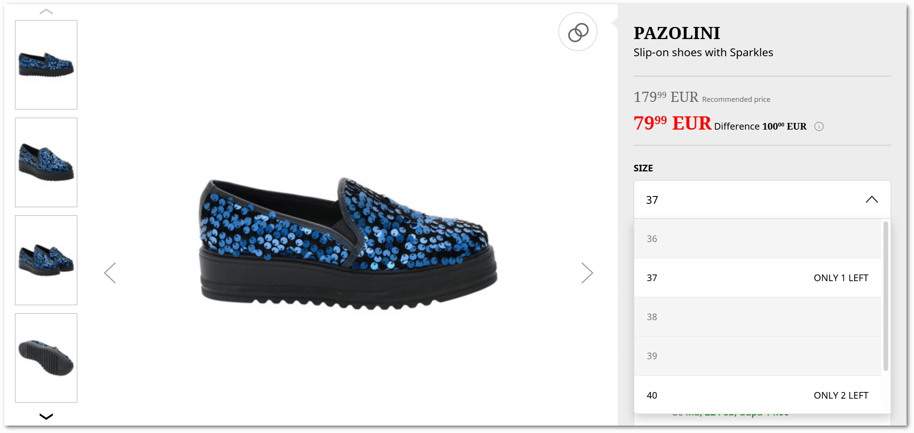
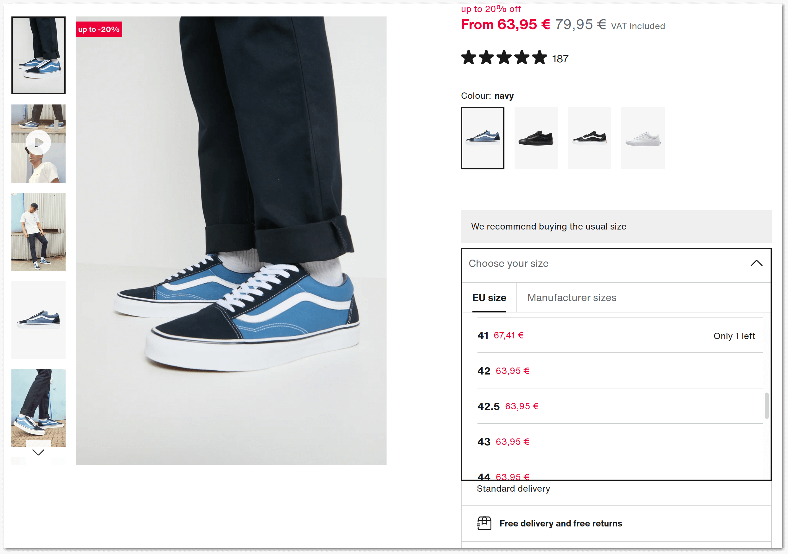

# Product Variants

Product variants are unique kinds of a product that differ from each other in
a specific way such as size, color, amount of memory, etc. Variants can have
their own pricing, inventory tracking etc.

Variants may be created based on product [properties](properties.md),
but you can also use the product variations without the properties at all.

## The Two Approaches

Product variations are typically achieved using one of the following approaches:

- Distinct Variant Models (hierarchical relationship)
- Variants as Links (peer relationship)

### Model Level Variants

With this approach, you have a **main product** and one or more **product variant** entries.

This way the variants are expressed in the model layer, and common attributes
(name, description, pictures, etc) can be shared at the main product, whereas
the specifics (size, price, SKU, etc) need be set at the variant.

As a consequence, a product is stored in two separate tables, the model layer
becomes more complex and a bit more abstract. If every product is stored this
way, then even products without actual variants must have at least one variant
on the data level.

Still, if your shop uses a massive amount of variants
(e.g. clothes or shoes offered in many sizes), then this is the structure that
better reflects the reality.

This method is supported by the [Master Products](master-products.md) module.

### Variants As Links

Using this approach, products remain fully standalone entities and the definition
of variants happens solely via defining links between them.

It can be done by defining variant groups that link products based on a property.
The variation is being defined by a variant group, an optional property, and
the products.

This way, there are no different kinds of products, and the simple
[Product model](products.md) remains the final entity.

It keeps the model layer simple and forces no master variant on products without variants.

As a consequence, common attributes are duplicated across product entities and the
complexity is placed in the linking/grouping mechanism.

This method is supported by the [Links](links.md) module.

## Digging Deeper

The [Links](links.md) module can be used for constituting product variants between existing products.

Due to the equal relationship between linked entries, it also means that all
product variants have to exist as fully standalone products, with all data points,
even if they're data is common.

Depending on your particular scenario this can be either a benefit or a drawback.

As an example, it is beneficial if your PIM, ERP or other source of product data
supplies variants as standalone products. Let's say you have a Whiskey
"Nikka Miyagikyo Discovery" having sorts of bottle size 0.7L and 0.2L,
both are stored as fully standalone products, with their very own data.

As counter example, the peer-structure is a disadvantage, if the product
variants are almost identical. A typical example is a "Nike AirMax" offered
in multiple sizes (39, 40, 41, etc). In this case you'll unlikely have
different pictures, description, etc for the shoes. Moreover, you will
want to have a single page for the product and only a dropdown for the variants.

To achieve such functionality, the [Master Products](master-products.md) module
is likely a better choice.

It is possible to freely combine the links and the master products to achieve
the desired structure of your shop.

## Examples

The screenshots below are taken from real shops, to demonstrate how people
in the wild are using the described approaches.

### Product Variant Links

The picture below displays a product page that leverages the link-based approach.

If you study the picture, you'll notice the followings:

- The phone has variants by color and memory size
- You are now on the Blue, 128GB variant
- The product title is distinct for this specific variant
- The picture of the product is specific for this variant

It is not visible, but the thumbnails (both color and RAM) are links to the
standalone product pages of red, black, etc and the 256GB, 512GB variants
of this iphone.

If you click the red thumbnail, it will open the new product page:

As you see, this page displays another SKU, title, and only displays the images of the red phone.

In a single word, every variant is a fully standalone product.

### Variant Models

The picture below displays a product page that leverages the model-based approach.

If you study the picture, you'll notice the followings:

- The product has variants by shoe size
- There are no links to another product page
- You can choose a size (variant) from the dropdown
- Each variant has a separate stock
- The pictures of the product are not variant specific (they belong to the "master" product)

In a single sentence, there is one (master) product, but you can only buy one of its variants (by size).

### The Combination of the Two

The picture below displays a product page that uses a combination of both approaches.

If you study the picture, you'll notice the followings:

- The product has variants by color and shoe size
- You are now on the Navy color variant
- The pictures of the product are specific for the color variant
- There color variant thumbnail are links to another product page
- You can choose the size (variant) from the dropdown
- Each size variant has a separate stock and price

In a summary, the color variants are fully standalone products, but they
are master products, of which you can only buy a size variants.
