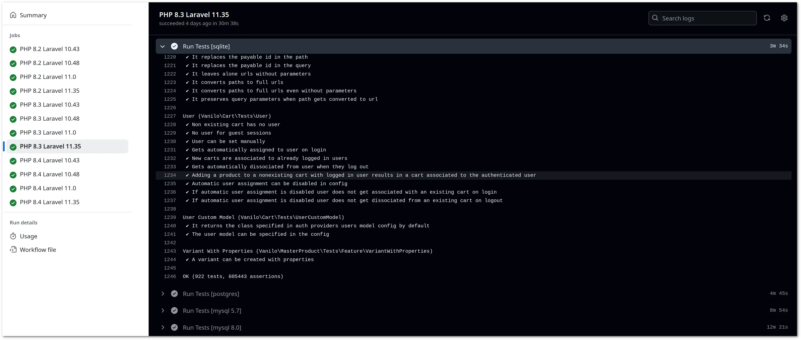

# What Is Vanilo?

Vanilo is an **E-commerce Framework for Laravel**.

Vanilo is the obvious choice for Laravel Developers for building an E-commerce application with full control over the code.

## Is It A Ready-To-Use E-commerce Application?

Unlike WooCommerce or PrestaShop, the Vanilo Framework is not an application, but a set of prebuilt Laravel components.
You can utilize Vanilo either to:

1. add e-commerce features to an existing Laravel Application, or
2. to create a new Laravel E-commerce application.

> A standalone, ready-made Laravel application is coming in Q1 2025!

## Is It Ready For Production?

Yes.

Starting from as early as v0.2 there has been a well-defined [upgrade path](upgrade.md) up until the
current latest version.

Refer to [Release Notes](releases.md) for more details.

Every component is well-tested, and Vanilo uses the [Semantic Versioning Scheme](https://semver.org), meaning you won't
face unexpected breaking changes.

## Why Another E-commerce Package?

Shortly, because back in 2017 there was no decent one **particularly for Laravel**. There's a slightly
longer
[article on medium](https://medium.com/@attilafulop/e-commerce-platform-for-laravel-c09a2bcfe8c6)
about why it came to life.

## Alternatives

| Name                                         | Based on          | Version (Dec 2024) |
|:---------------------------------------------|:------------------|:-------------------|
| Vanilo                                       | Laravel 10-11     | 4.2                |
| [Bagisto](https://bagisto.com/en/)           | Laravel 11        | 2.2                |
| [Lunar](https://lunarphp.io) (ex GetCandy)   | Laravel 10-11     | 1.0-beta           |
| [Aimeos](https://aimeos.org/)                | Laravel 10-11     | 2024.10.9          |
| [Sylius](http://sylius.org/)                 | Symfony 6.4+/7.1+ | 2.0                |
| [ORO Commerce](https://www.orocommerce.com/) | Symfony 6.4       | 6.0                |
| [Magento](https://magento.com/)              | Laminas MVC 3.6   | 2.4.7              |

> Despite being 8+ years old, this article is still a good read about further e-commerce alternatives: [E-commerce Status Quo 2016](https://blog.fortrabbit.com/ecommerce-status-quo-2016).
